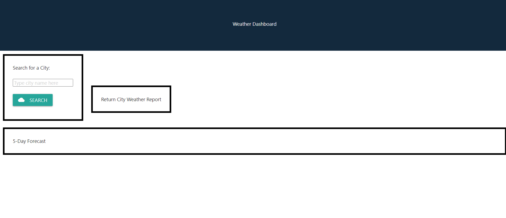

  <h1 align="center">Weather Dashboard 🎉 </h1>
    
   
  
  ## 👇  Description  👇
---
  
  This application will retrieve weather data from the OpenWeather One Call API in order to display current and future conditions depending on which city the user has searched for.
 
  ## Table of Contents 
  - [Description](#--description--)
  - [Installation Instructions 📣](#installation-instructions-)
  - [Usage 🖱️](#usage-️)
  - [Contributors 🧑‍🤝‍🧑](#contributors-)
  - [Screenshots 📷](#screenshots-)
  - [Questions ❔](#questions-)
  - [License ©️](#license-️)
    
  ## Installation Instructions 📣
---

  
  
  ## Usage 🖱️
---

  
  
  ## Contributors 🧑‍🤝‍🧑
---
  Gerald Plotke
  
  ## Screenshots 📷
---

  |  weather dashboard                              |                                |                                | 
  |:------------------------------------------------------:|:------------------------------------------------------:|:------------------------------------------------------:|
  |  
  |                                                        |                                                        |                                                        |
  |                                                        |                                                        |                                                        |   

  ## Questions ❔

---

  For any questions please email Jerry.plotke@gmail.com 
   
  :octocat: Find me on GitHub: [GPLOTKE](https://github.com/GPLOTKE) 
   
  📬 Email me with any questions: Jerry.plotke@gmail.com  
  
  ## License 
---
   
  This application is covered by <a href="https://opensource.org/licenses/MIT"> the MIT License</a> license. 

  --------------------------- 
 

  This README was generated with [writemeREADME](https://github.com/proto133/writemeREADME) 

Deployed application:

https://gplotke.github.io/06-Weather-Dashboard/

GitHub repository:

https://github.com/GPLOTKE/06-Homework-Server-Side-APIs